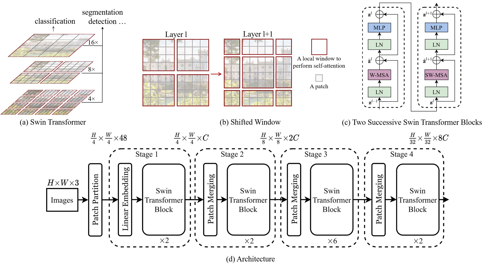

# Swin Transformer

[](https://paperswithcode.com/sota/object-detection-on-coco?p=swin-transformer-v2-scaling-up-capacity-and)
[](https://paperswithcode.com/sota/instance-segmentation-on-coco?p=swin-transformer-v2-scaling-up-capacity-and)
[](https://paperswithcode.com/sota/semantic-segmentation-on-ade20k?p=swin-transformer-v2-scaling-up-capacity-and)
[](https://paperswithcode.com/sota/action-classification-on-kinetics-400?p=swin-transformer-v2-scaling-up-capacity-and)


By [Ze Liu](https://github.com/zeliu98/)\*, [Yutong Lin](https://github.com/impiga)\*, [Yue Cao](http://yue-cao.me)\*, [Han Hu](https://ancientmooner.github.io/)\*, [Yixuan Wei](https://github.com/weiyx16), [Zheng Zhang](https://stupidzz.github.io/), [Stephen Lin](https://scholar.google.com/citations?user=c3PYmxUAAAAJ&hl=en) and [Baining Guo](https://www.microsoft.com/en-us/research/people/bainguo/).

This repo is the official implementation of ["Swin Transformer: Hierarchical Vision Transformer using Shifted Windows"](https://arxiv.org/pdf/2103.14030.pdf). It currently includes code and models for the following tasks:

> **Image Classification**: Included in this repo. See [get_started.md](get_started.md) for a quick start.

> **Object Detection and Instance Segmentation**: See [Swin Transformer for Object Detection](https://github.com/SwinTransformer/Swin-Transformer-Object-Detection).

> **Semantic Segmentation**: See [Swin Transformer for Semantic Segmentation](https://github.com/SwinTransformer/Swin-Transformer-Semantic-Segmentation).

> **Video Action Recognition**: See [Video Swin Transformer](https://github.com/SwinTransformer/Video-Swin-Transformer).

> **Semi-Supervised Object Detection**: See [Soft Teacher](https://github.com/microsoft/SoftTeacher).

> **SSL: Contrasitive Learning**: See [Transformer-SSL](https://github.com/SwinTransformer/Transformer-SSL).

> :fire:	 **SSL: Masked Image Modeling**: See [SimMIM](https://github.com/microsoft/SimMIM).


## Updates
***10/12/2021***

`News`: Swin Transformer received ICCV 2021 best paper award (Marr Prize).

***08/09/2021***
1. [Soft Teacher](https://arxiv.org/pdf/2106.09018v2.pdf) will appear at ICCV2021. The code will be released at [GitHub Repo](https://github.com/microsoft/SoftTeacher). `Soft Teacher` is an end-to-end semi-supervisd object detection method, achieving a new record on the COCO test-dev: `61.3 box AP` and `53.0 mask AP`.
 
***07/03/2021***
1. Add **Swin MLP**, which is an adaption of `Swin Transformer` by replacing all multi-head self-attention (MHSA) blocks by MLP layers (more precisely it is a group linear layer). The shifted window configuration can also significantly improve the performance of vanilla MLP architectures. 

***06/25/2021***
1. [Video Swin Transformer](https://arxiv.org/abs/2106.13230) is released at [Video-Swin-Transformer](https://github.com/SwinTransformer/Video-Swin-Transformer).
`Video Swin Transformer` achieves state-of-the-art accuracy on a broad range of video recognition benchmarks, including action recognition (`84.9` top-1 accuracy on Kinetics-400 and `86.1` top-1 accuracy on Kinetics-600 with `~20x` less pre-training data and `~3x` smaller model size) and temporal modeling (`69.6` top-1 accuracy on Something-Something v2).

***05/12/2021***
1. Used as a backbone for `Self-Supervised Learning`: [Transformer-SSL](https://github.com/SwinTransformer/Transformer-SSL)

Using Swin-Transformer as the backbone for self-supervised learning enables us to evaluate the transferring performance of the learnt representations on down-stream tasks, which is missing in previous works due to the use of ViT/DeiT, which has not been well tamed for down-stream tasks.

***04/12/2021***

Initial commits:

1. Pretrained models on ImageNet-1K ([Swin-T-IN1K](https://github.com/SwinTransformer/storage/releases/download/v1.0.0/swin_tiny_patch4_window7_224.pth), [Swin-S-IN1K](https://github.com/SwinTransformer/storage/releases/download/v1.0.0/swin_small_patch4_window7_224.pth), [Swin-B-IN1K](https://github.com/SwinTransformer/storage/releases/download/v1.0.0/swin_base_patch4_window7_224.pth)) and ImageNet-22K ([Swin-B-IN22K](https://github.com/SwinTransformer/storage/releases/download/v1.0.0/swin_base_patch4_window7_224_22k.pth), [Swin-L-IN22K](https://github.com/SwinTransformer/storage/releases/download/v1.0.0/swin_large_patch4_window7_224_22k.pth)) are provided.
2. The supported code and models for ImageNet-1K image classification, COCO object detection and ADE20K semantic segmentation are provided.
3. The cuda kernel implementation for the [local relation layer](https://arxiv.org/pdf/1904.11491.pdf) is provided in branch [LR-Net](https://github.com/microsoft/Swin-Transformer/tree/LR-Net).

## Introduction

**Swin Transformer** (the name `Swin` stands for **S**hifted **win**dow) is initially described in [arxiv](https://arxiv.org/abs/2103.14030), which capably serves as a
general-purpose backbone for computer vision. It is basically a hierarchical Transformer whose representation is
computed with shifted windows. The shifted windowing scheme brings greater efficiency by limiting self-attention
computation to non-overlapping local windows while also allowing for cross-window connection.

Swin Transformer achieves strong performance on COCO object detection (`58.7 box AP` and `51.1 mask AP` on test-dev) and
ADE20K semantic segmentation (`53.5 mIoU` on val), surpassing previous models by a large margin.



## Main Results on ImageNet with Pretrained Models

**ImageNet-1K and ImageNet-22K Pretrained Models**

| name | pretrain | resolution |acc@1 | acc@5 | #params | FLOPs | FPS| 22K model | 1K model |
| :---: | :---: | :---: | :---: | :---: | :---: | :---: | :---: |:---: |:---: |
| Swin-T | ImageNet-1K | 224x224 | 81.2 | 95.5 | 28M | 4.5G | 755 | - | [github](https://github.com/SwinTransformer/storage/releases/download/v1.0.0/swin_tiny_patch4_window7_224.pth)/[baidu](https://pan.baidu.com/s/156nWJy4Q28rDlrX-rRbI3w)/[config](configs/swin_tiny_patch4_window7_224.yaml)/[log](https://github.com/SwinTransformer/storage/files/7745562/log_swin_tiny_patch4_window7_224.txt) |
| Swin-S | ImageNet-1K | 224x224 | 83.2 | 96.2 | 50M | 8.7G | 437 | - | [github](https://github.com/SwinTransformer/storage/releases/download/v1.0.0/swin_small_patch4_window7_224.pth)/[baidu](https://pan.baidu.com/s/1KFjpj3Efey3LmtE1QqPeQg)/[config](configs/swin_small_patch4_window7_224.yaml)/[log](https://github.com/SwinTransformer/storage/files/7745563/log_swin_small_patch4_window7_224.txt) |
| Swin-B | ImageNet-1K | 224x224 | 83.5 | 96.5 | 88M | 15.4G | 278  | - | [github](https://github.com/SwinTransformer/storage/releases/download/v1.0.0/swin_base_patch4_window7_224.pth)/[baidu](https://pan.baidu.com/s/16bqCTEc70nC_isSsgBSaqQ)/[config](configs/swin_base_patch4_window7_224.yaml)/[log](https://github.com/SwinTransformer/storage/files/7745564/log_swin_base_patch4_window7_224.txt) |
| Swin-B | ImageNet-1K | 384x384 | 84.5 | 97.0 | 88M | 47.1G | 85 | - | [github](https://github.com/SwinTransformer/storage/releases/download/v1.0.0/swin_base_patch4_window12_384.pth)/[baidu](https://pan.baidu.com/s/1xT1cu740-ejW7htUdVLnmw)/[config](configs/swin_base_patch4_window12_384_finetune.yaml) |
| Swin-B | ImageNet-22K | 224x224 | 85.2 | 97.5 | 88M | 15.4G | 278 | [github](https://github.com/SwinTransformer/storage/releases/download/v1.0.0/swin_base_patch4_window7_224_22k.pth)/[baidu](https://pan.baidu.com/s/1y1Ec3UlrKSI8IMtEs-oBXA) | [github](https://github.com/SwinTransformer/storage/releases/download/v1.0.0/swin_base_patch4_window7_224_22kto1k.pth)/[baidu](https://pan.baidu.com/s/1n_wNkcbRxVXit8r_KrfAVg)/[config](configs/swin_base_patch4_window7_224_22kto1k_finetune.yaml) |
| Swin-B | ImageNet-22K | 384x384 | 86.4 | 98.0 | 88M | 47.1G | 85 | [github](https://github.com/SwinTransformer/storage/releases/download/v1.0.0/swin_base_patch4_window12_384_22k.pth)/[baidu](https://pan.baidu.com/s/1vwJxnJcVqcLZAw9HaqiR6g) | [github](https://github.com/SwinTransformer/storage/releases/download/v1.0.0/swin_base_patch4_window12_384_22kto1k.pth)/[baidu](https://pan.baidu.com/s/1caKTSdoLJYoi4WBcnmWuWg)/[config](configs/swin_base_patch4_window12_384_22kto1k_finetune.yaml) |
| Swin-L | ImageNet-22K | 224x224 | 86.3 | 97.9 | 197M | 34.5G | 141 | [github](https://github.com/SwinTransformer/storage/releases/download/v1.0.0/swin_large_patch4_window7_224_22k.pth)/[baidu](https://pan.baidu.com/s/1pws3rOTFuOebBYP3h6Kx8w) | [github](https://github.com/SwinTransformer/storage/releases/download/v1.0.0/swin_large_patch4_window7_224_22kto1k.pth)/[baidu](https://pan.baidu.com/s/1NkQApMWUhxBGjk1ne6VqBQ)/[config](configs/swin_large_patch4_window7_224_22kto1k_finetune.yaml) |
| Swin-L | ImageNet-22K | 384x384 | 87.3 | 98.2 | 197M | 103.9G | 42 | [github](https://github.com/SwinTransformer/storage/releases/download/v1.0.0/swin_large_patch4_window12_384_22k.pth)/[baidu](https://pan.baidu.com/s/1sl7o_bJA143OD7UqSLAMoA) | [github](https://github.com/SwinTransformer/storage/releases/download/v1.0.0/swin_large_patch4_window12_384_22kto1k.pth)/[baidu](https://pan.baidu.com/s/1X0FLHQyPOC6Kmv2CmgxJvA)/[config](configs/swin_large_patch4_window12_384_22kto1k_finetune.yaml) |

**ImageNet-1K Pretrained Swin MLP Models**

| name | pretrain | resolution |acc@1 | acc@5 | #params | FLOPs | FPS |  1K model |
| :---: | :---: | :---: | :---: | :---: | :---: | :---: | :---: | :---: |
| [Mixer-B/16](https://arxiv.org/pdf/2105.01601.pdf) | ImageNet-1K | 224x224 | 76.4 | - | 59M | 12.7G | - | [official repo](https://github.com/google-research/vision_transformer) |
| [ResMLP-S24](https://arxiv.org/abs/2105.03404) | ImageNet-1K | 224x224 | 79.4 | - | 30M | 6.0G | 715 | [timm](https://github.com/rwightman/pytorch-image-models) |
| [ResMLP-B24](https://arxiv.org/abs/2105.03404) | ImageNet-1K | 224x224 | 81.0 | - | 116M | 23.0G |  231 | [timm](https://github.com/rwightman/pytorch-image-models) |
| Swin-T/C24 | ImageNet-1K | 256x256 | 81.6 | 95.7 | 28M | 5.9G | 563 | [github](https://github.com/SwinTransformer/storage/releases/download/v1.0.5/swin_tiny_c24_patch4_window8_256.pth)/[baidu](https://pan.baidu.com/s/17k-7l6Sxt7uZ7IV0f26GNQ)/[config](configs/swin_tiny_c24_patch4_window8_256.yaml) |
| SwinMLP-T/C24 | ImageNet-1K | 256x256 | 79.4 | 94.6 | 20M | 4.0G | 807 | [github](https://github.com/SwinTransformer/storage/releases/download/v1.0.5/swin_mlp_tiny_c24_patch4_window8_256.pth)/[baidu](https://pan.baidu.com/s/1Sa4vP5R0M2RjfIe9HIga-Q)/[config](configs/swin_mlp_tiny_c24_patch4_window8_256.yaml) |
| SwinMLP-T/C12 | ImageNet-1K | 256x256 | 79.6 | 94.7 | 21M | 4.0G | 792 | [github](https://github.com/SwinTransformer/storage/releases/download/v1.0.5/swin_mlp_tiny_c12_patch4_window8_256.pth)/[baidu](https://pan.baidu.com/s/1mM9J2_DEVZHUB5ASIpFl0w)/[config](configs/swin_mlp_tiny_c12_patch4_window8_256.yaml) |
| SwinMLP-T/C6 | ImageNet-1K | 256x256 | 79.7 | 94.9 | 23M | 4.0G | 766 | [github](https://github.com/SwinTransformer/storage/releases/download/v1.0.5/swin_mlp_tiny_c6_patch4_window8_256.pth)/[baidu](https://pan.baidu.com/s/1hUTYVT2W1CsjICw-3W-Vjg)/[config](configs/swin_mlp_tiny_c6_patch4_window8_256.yaml) |
| SwinMLP-B | ImageNet-1K | 224x224 | 81.3 | 95.3 | 61M | 10.4G | 409 | [github](https://github.com/SwinTransformer/storage/releases/download/v1.0.5/swin_mlp_base_patch4_window7_224.pth)/[baidu](https://pan.baidu.com/s/1zww3dnbX3GxNiGfb-GwyUg)/[config](configs/swin_mlp_base_patch4_window7_224.yaml) |

Note: access code for `baidu` is `swin`. C24 means each head has 24 channels.

## Main Results on Downstream Tasks

**COCO Object Detection (2017 val)**

| Backbone | Method | pretrain | Lr Schd | box mAP | mask mAP | #params | FLOPs |
| :---: | :---: | :---: | :---: | :---: | :---: | :---: | :---: |
| Swin-T | Mask R-CNN | ImageNet-1K | 3x | 46.0 | 41.6 | 48M | 267G |
| Swin-S | Mask R-CNN | ImageNet-1K | 3x | 48.5 | 43.3 | 69M | 359G |
| Swin-T | Cascade Mask R-CNN | ImageNet-1K | 3x | 50.4 | 43.7 | 86M | 745G |
| Swin-S | Cascade Mask R-CNN | ImageNet-1K |  3x | 51.9 | 45.0 | 107M | 838G |
| Swin-B | Cascade Mask R-CNN | ImageNet-1K |  3x | 51.9 | 45.0 | 145M | 982G |
| Swin-T | RepPoints V2 | ImageNet-1K | 3x | 50.0 | - | 45M | 283G |
| Swin-T | Mask RepPoints V2 | ImageNet-1K | 3x | 50.3 | 43.6 | 47M | 292G |
| Swin-B | HTC++ | ImageNet-22K | 6x | 56.4 | 49.1 | 160M | 1043G |
| Swin-L | HTC++ | ImageNet-22K | 3x | 57.1 | 49.5 | 284M | 1470G |
| Swin-L | HTC++<sup>*</sup> | ImageNet-22K | 3x | 58.0 | 50.4 | 284M | - |

Note: <sup>*</sup> indicates multi-scale testing.

**ADE20K Semantic Segmentation (val)**

| Backbone | Method | pretrain | Crop Size | Lr Schd | mIoU | mIoU (ms+flip) | #params | FLOPs |
| :---: | :---: | :---: | :---: | :---: | :---: | :---: | :---: | :---: |
| Swin-T | UPerNet | ImageNet-1K | 512x512 | 160K | 44.51 | 45.81 | 60M | 945G |
| Swin-S | UperNet | ImageNet-1K | 512x512 | 160K | 47.64 | 49.47 | 81M | 1038G |
| Swin-B | UperNet | ImageNet-1K | 512x512 | 160K | 48.13 | 49.72 | 121M | 1188G |
| Swin-B | UPerNet | ImageNet-22K | 640x640 | 160K | 50.04 | 51.66 | 121M | 1841G |
| Swin-L | UperNet | ImageNet-22K | 640x640 | 160K | 52.05 | 53.53 | 234M | 3230G |

## Citing Swin Transformer

```
@article{liu2021Swin,
  title={Swin Transformer: Hierarchical Vision Transformer using Shifted Windows},
  author={Liu, Ze and Lin, Yutong and Cao, Yue and Hu, Han and Wei, Yixuan and Zhang, Zheng and Lin, Stephen and Guo, Baining},
  journal={International Conference on Computer Vision (ICCV)},
  year={2021}
}
```
```
@misc{liu2021swinv2,
      title={Swin Transformer V2: Scaling Up Capacity and Resolution}, 
      author={Ze Liu and Han Hu and Yutong Lin and Zhuliang Yao and Zhenda Xie and Yixuan Wei and Jia Ning and Yue Cao and Zheng Zhang and Li Dong and Furu Wei and Baining Guo},
      year={2021},
      eprint={2111.09883},
      archivePrefix={arXiv},
      primaryClass={cs.CV}
}
```

## Getting Started

- For **Image Classification**, please see [get_started.md](get_started.md) for detailed instructions.
- For **Object Detection and Instance Segmentation**, please see [Swin Transformer for Object Detection](https://github.com/SwinTransformer/Swin-Transformer-Object-Detection).
- For **Semantic Segmentation**, please see [Swin Transformer for Semantic Segmentation](https://github.com/SwinTransformer/Swin-Transformer-Semantic-Segmentation).
- For **Self-Supervised Learning**, please see [Transformer-SSL](https://github.com/SwinTransformer/Transformer-SSL).
- For **Video Recognition**, please see [Video Swin Transformer](https://github.com/SwinTransformer/Video-Swin-Transformer).

## Third-party Usage and Experiments

***In this pargraph, we cross link third-party repositories which use Swin and report results. You can let us know by raising an issue*** 

(`Note please report accuracy numbers and provide trained models in your new repository to facilitate others to get sense of correctness and model behavior`)

[12/21/2021] Swin Transformer for StyleGAN: [StyleSwin](https://github.com/microsoft/StyleSwin)

[12/13/2021] Swin Transformer for Face Recognition: [FaceX-Zoo](https://github.com/JDAI-CV/FaceX-Zoo)

[08/29/2021] Swin Transformer for Image Restoration: [SwinIR](https://github.com/JingyunLiang/SwinIR)

[08/12/2021] Swin Transformer for person reID: [https://github.com/layumi/Person_reID_baseline_pytorch](https://github.com/layumi/Person_reID_baseline_pytorch)

[06/29/2021] Swin-Transformer in PaddleClas and inference based on whl package: [https://github.com/PaddlePaddle/PaddleClas](https://github.com/PaddlePaddle/PaddleClas)

[04/14/2021] Swin for RetinaNet in Detectron: https://github.com/xiaohu2015/SwinT_detectron2.

[04/16/2021] Included in a famous model zoo: https://github.com/rwightman/pytorch-image-models.

[04/20/2021] Swin-Transformer classifier inference using TorchServe: https://github.com/kamalkraj/Swin-Transformer-Serve

## Contributing

This project welcomes contributions and suggestions.  Most contributions require you to agree to a
Contributor License Agreement (CLA) declaring that you have the right to, and actually do, grant us
the rights to use your contribution. For details, visit https://cla.opensource.microsoft.com.

When you submit a pull request, a CLA bot will automatically determine whether you need to provide
a CLA and decorate the PR appropriately (e.g., status check, comment). Simply follow the instructions
provided by the bot. You will only need to do this once across all repos using our CLA.

This project has adopted the [Microsoft Open Source Code of Conduct](https://opensource.microsoft.com/codeofconduct/).
For more information see the [Code of Conduct FAQ](https://opensource.microsoft.com/codeofconduct/faq/) or
contact [opencode@microsoft.com](mailto:opencode@microsoft.com) with any additional questions or comments.

## Trademarks

This project may contain trademarks or logos for projects, products, or services. Authorized use of Microsoft 
trademarks or logos is subject to and must follow 
[Microsoft's Trademark & Brand Guidelines](https://www.microsoft.com/en-us/legal/intellectualproperty/trademarks/usage/general).
Use of Microsoft trademarks or logos in modified versions of this project must not cause confusion or imply Microsoft sponsorship.
Any use of third-party trademarks or logos are subject to those third-party's policies.
