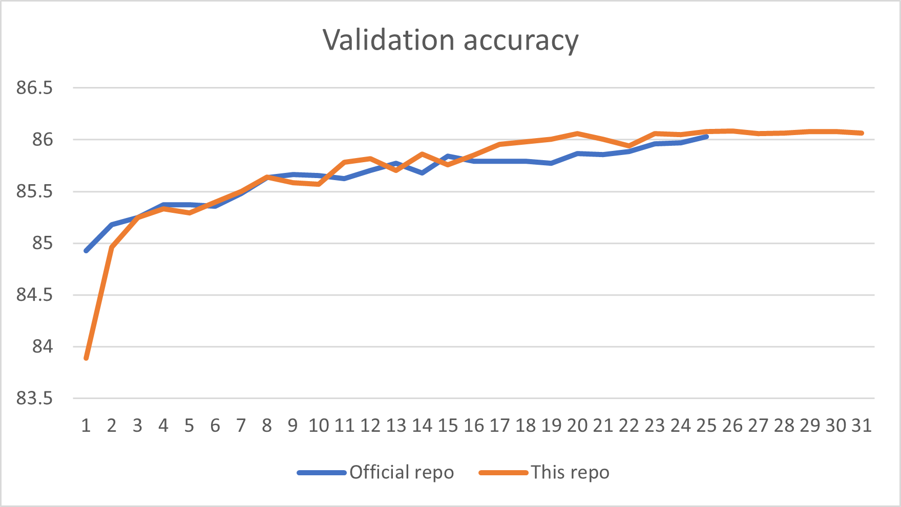

# Accelerate Training for SwinTransformer
Utilize Nvidia/apex fused ops and our fused ops, based on commit id `cbaa0d8`.


## Acceleration strategies
- apex O2
- fused_adam (`apex` fused ops, to replace AdamW)
- fused_layernorm (`apex` fused ops, to replace nn.LayerNorm)
- fused_mlp (`apex` fused ops, to replace MLP module as the dropout rate is 0)
- fused_dense (`apex` fused ops, to replace nn.Linear)
- fused_window_process (fuse window shift & partition)
- unfused_mha (fuse qk_result + relative_pos_bias + mask + softmax)


## Usage
### Build Nvidia/Apex  
Follow the guidance of [Nvidia/Apex](https://github.com/NVIDIA/apex)  and use the following codes to build it.
```
pip install -v --disable-pip-version-check --no-cache-dir \
  --global-option="--cpp_ext" \
  --global-option="--cuda_ext" \
  --global-option="--fast_multihead_attn" \
  ./
```

### Build fused Ops
These Ops are developed for SwinTransformer.
```
cd $SWIN_PATH/fused_ops/fmha
python setup.py install
cd $SWIN_PATH/fused_ops/window_process
python setup.py install
```

### Start training / fine-tuning
```
python -m torch.distributed.launch --nproc_per_node 1 --master_port 12345 \
	main.py \
	--cfg configs/swin_large_patch4_window7_224_22kto1k_finetune.yaml \
	--pretrained /work/codes/Swin-Transformer/models/swin_large_patch4_window7_224_22k.pth \
	--data-path /mnt/nvdl/datasets/imagenet \
	--batch-size 128 \
	--amp-opt-level O2 \
	--log_id fused \
	--fused_window_process \
	--fused_layernorm \
	--fused_adam \
	--unfused_mha \
	--fused_mlp \
	--fused_dense
```

## Performance
> Experimental environment: single A100-80G

### Throughput
> Use `--throughput` in the launch bash

| Code ver. | precision | batchsize | throughput |
|---|---|---|---|
| Official `78cec9a` | torch.cuda.amp | 128 | 540.4141554238416 |
| This repo (O0 baseline) | O0 |128 | 540.8349981747887 |
| This repo (+) | O0 |128 | 567.3833912349154 |
| This repo (O2 baseline) | O2 |128 | 1035.148253639781 |
| This repo (+) | O2 |128 | 1164.6363324181038 |

[Note] For `O0` mode, we find the fastest arguments should exclude `--fused_mlp` and `--fused_dense` in our case.

### Training speed
> Use time cost in the plotted logs. Average first several iterations.

| Code ver. | precision | batchsize | Time/iter | Image/second | speed-up |
|---|---|---|---|---|---|
| Official `78cec9a` | torch.cuda.amp | 128 | 0.4852 | 263.82 | 1x |
| This repo (O0 baseline) | O0 | 128 | 0.8010 | 159.81 | 0.61x |
| This repo (+) | O2 | 128 | 0.3837 | 333.61 | 1.27x |
| Official `78cec9a` | torch.cuda.amp | 256 | 0.9093 | 281.55 | 1x |
| This repo (+) | O2 | 256 | 0.7273 | 351.97 | 1.25x |

### Convergence validation
- Finetune using Swin-Large model.

It seems no accuracy loss for finetuning part.

## TODO
- [ ] Validate the training accuracy for pre-training.
- [ ] Further optimize kernels.


